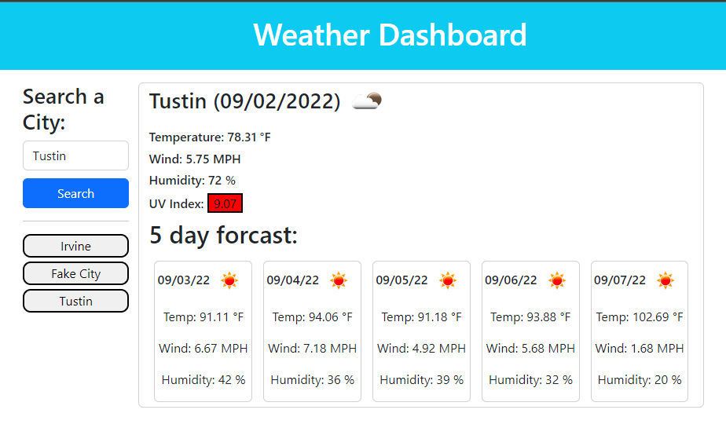
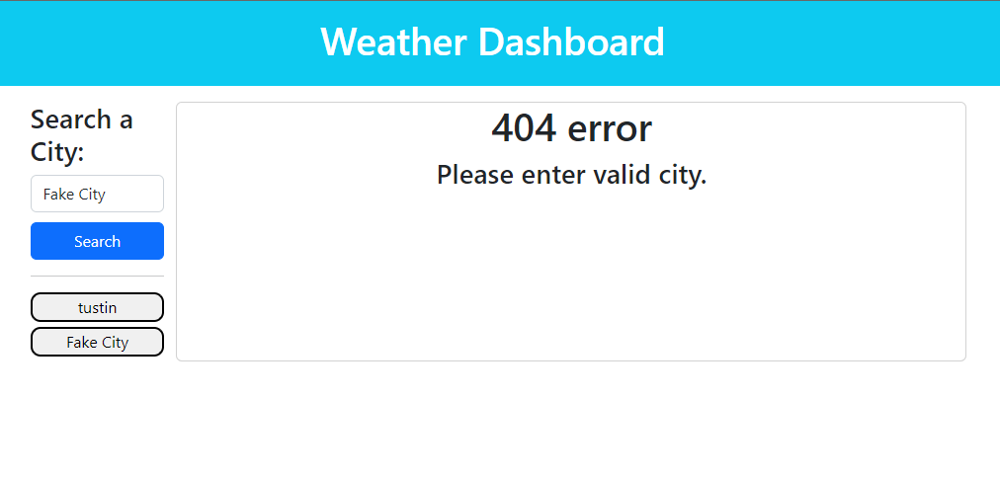

# 06_Weather_Dashboard

## Description
Weather dashboard to fetch current weather and UV index for searched city.  Will also give 5 day forcast.  404 error message will pop up if invalid city is searched.

## Technologies used

* HTML
* CSS
* Javascript
* Openweather API
* Jquery
* Moment.js

## Link to website
https://crestatic.github.io/6_Weather_Dashboard/

## Screenshots

### Error Image
